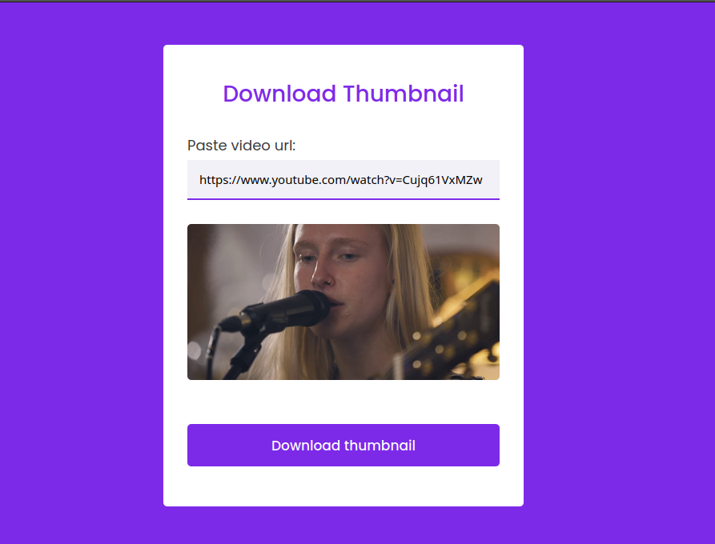
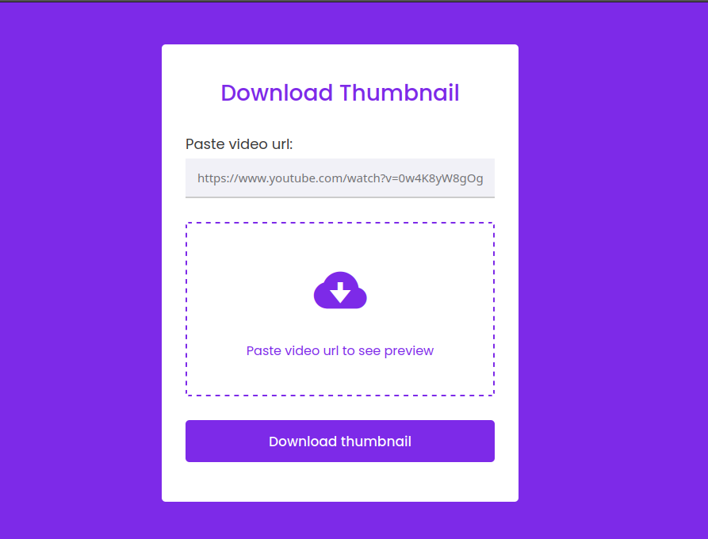

# Youtube Thumbnail Downloader

Este é um simples aplicativo web em PHP que permite baixar a miniatura de um vídeo do YouTube. Basta colar a URL do vídeo e clicar no botão "Download thumbnail" para obter a miniatura.

## Pré-requisitos

Certifique-se de ter os seguintes requisitos antes de usar o aplicativo:

    Servidor web com suporte para PHP (por exemplo, Apache, Nginx).
    PHP instalado e configurado no servidor.

## Instalação

Siga as etapas abaixo para instalar e configurar o aplicativo:

    Faça o download dos arquivos do aplicativo.
    Coloque os arquivos em um diretório acessível pelo seu servidor web.
    Certifique-se de que a extensão cURL do PHP esteja habilitada no servidor.
    Inicie o servidor web.

## Utilização

Siga as etapas abaixo para utilizar o aplicativo:

    Abra o navegador da web.
    Acesse o aplicativo através do URL correspondente ao diretório onde você colocou os arquivos do aplicativo.
    Na página inicial do aplicativo, cole a URL do vídeo do YouTube no campo "Paste video url".
    Aguarde até que a miniatura do vídeo seja exibida na área de visualização.
    Clique no botão "Download thumbnail" para baixar a miniatura do vídeo.

## Notas

    Certifique-se de fornecer uma URL válida do vídeo do YouTube.
    A miniatura será baixada como um arquivo chamado "thumbnail.jpg".

## Screenshots

